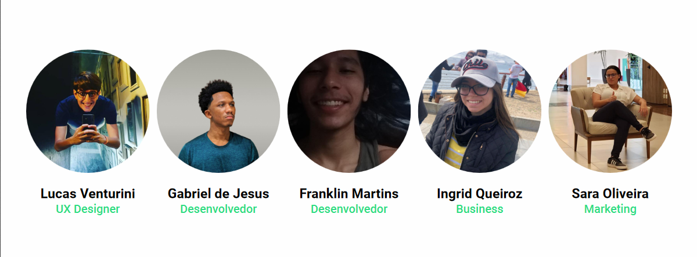

# Semente

🌱 Sowing the habit of reading

The proposal of the Seed is to encourage the habit of reading in formats different from the way we are used to.

  
     
   

   

   
   
   

## 📈 Example of use

We seek to develop an app accessible to everyone, in a fun and educational way. The main functionalities that we seek to bring are: new formats to absorb reading, ranking and our AI that will be a virtual friend of the students and assistant of the teachers in encouraging reading.

## 🗃 Release history

- 0.1.0
  - Project finalized and studying the possibility of adding new resources
  - The first suitable launch
- 0.0.1
  - Work in progress

## 📝 Meta

Team

* Lucas Venturini - [UX Designer](https://www.linkedin.com/in/thelucasventurini) - lucas.venturini.duarte@gmail.com
* Gabriel de Jesus – [Front-end Developer](https://www.gabrieldesenvolvedor.com/) – devgabrieldejesus@mail.com
* Franklin Martins - [Back-end Developer]()
* Ingrid Queiroz - [Business](https://www.linkedin.com/in/ingridqcosta) – ingridq_@hotmail.com
* Sara Oliveira - [Marketing](https://www.linkedin.com/in/saracristinaoli/) - saracristinaredacao2@gmail.com

Distributed under the MIT License. See [LICENSE](LICENSE) for more information.

## 🚀 Contribution

1. Make the _fork_ of the project (<https://github.com/gabrieldejesus/semente/fork>)
2. Create a _branch_ for your modification (`git checkout -b my-new-resource`)
3. Do _commit_ (`git commit -am 'Adding a new resource ...'`)
4. _Push_ (`git push origin my-new-feature`)
5. Create a new _Pull Request_

**After your pull request is merged**, you can safely delete your branch.

---
